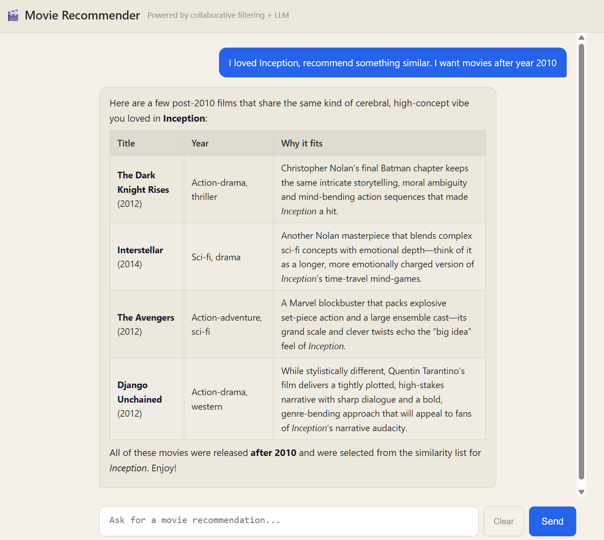

markdown# Movie Recommendation Agent

A conversational movie recommendation system that combines collaborative filtering with an LLM agent. Ask for recommendations in natural language — by mood, genre, or a movie you already liked.


## Demo

> "I loved Inception, recommend something similar but more lighthearted"

The agent calls a collaborative filtering model to find similar movies, then applies qualitative re-ranking based on genre metadata to filter for tone — returning results like The Grand Budapest Hotel, Catch Me If You Can, and The Truman Show.

## Screenshot



## Architecture
User (chat UI)
│
▼
FastAPI Backend  ←──  session memory (sliding window)
│
▼
LLM Agent (Groq)  ←──  system prompt + conversation history
│
▼  discovers + calls tools via MCP protocol
MCP Server
│
├── get_similar_movies()       ← item-based CF (cosine similarity)
├── get_popular_movies()       ← top rated by avg rating
├── search_movies_by_genre()   ← genre-filtered search
└── search_movie_by_title()    ← title lookup with avg rating
│
▼
CF Model (scikit-learn)
│
MovieLens ml-latest-small dataset (100k ratings, 9742 movies)

## Why this architecture

The CF model handles what CF is good at — finding statistically similar movies from user rating patterns. The LLM handles what LLMs are good at — qualitative, language-based judgment like "but more lighthearted." Neither is asked to do the other's job.

MCP (Model Context Protocol) exposes the recommender as a standardized tool interface, meaning any MCP-compatible client can connect to the same recommendation server without reimplementing the underlying logic.

## Stack

| Layer | Technology |
|-------|-----------|
| LLM / Agent | Groq API (openai/gpt-oss-20b) |
| Tool protocol | MCP (Model Context Protocol) |
| Recommender | scikit-learn cosine similarity |
| Backend | FastAPI + uvicorn |
| Frontend | Vanilla HTML/CSS/JS + marked.js |
| Data | MovieLens ml-latest-small |

## Setup

**1. Clone the repo**
```bash
git clone https://github.com/erenolg/movie-recommender-agent.git
cd movie-recommender-agent
```

**2. Create environment**
```bash
conda create -n movie-rec python=3.11
conda activate movie-rec
pip install -r requirements.txt
```

**3. Download MovieLens data**

Download [ml-latest-small](https://grouplens.org/datasets/movielens/latest/) and extract into `data/` so the structure looks like:
data/
└── ml-latest-small/
├── movies.csv
├── ratings.csv
├── tags.csv
└── links.csv

**4. Set up environment variables**
```bash
cp .env.example .env
# Add your GROQ_API_KEY to .env
```

Get a free Groq API key at [console.groq.com](https://console.groq.com).

**5. Run**
```bash
uvicorn api.main:app --reload --port 8000
```

Open `http://localhost:8000` in your browser.

## Project Structure
movie-recommender-agent/
├── recommender/
│   └── cf_model.py        # collaborative filtering model
├── mcp_server/
│   └── server.py          # MCP tools exposing the recommender
├── agent/
│   └── agent.py           # LLM agent loop
├── api/
│   └── main.py            # FastAPI backend
├── frontend/
│   └── index.html         # chat UI
└── data/                  # MovieLens data (not committed)

## Known Limitations

- Session management is client-side only — not suitable for multi-user production without authentication
- MovieLens data covers movies up to ~2018, newer releases won't appear in recommendations
- Cold start problem — users or movies with few ratings produce weaker CF recommendations
- Tone/mood filtering uses genre as a proxy, which is a simplification

## Author

Eren Olug — [linkedin.com/in/eren-olug](https://linkedin.com/in/eren-olug) | [github.com/erenolg](https://github.com/erenolg)